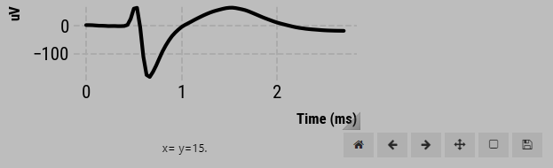
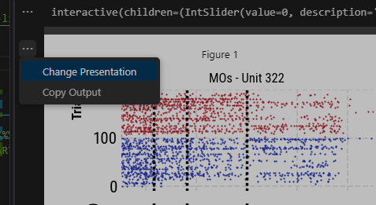
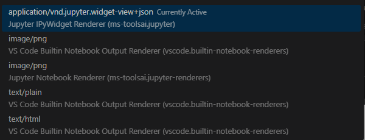

# code to analyze data from MAP project

## [LINK TO DATASET](https://dandiarchive.org/dandiset/000363?search=susu+chen&pos=1)

## DOWNLOAD INSTRUCTIONS

- you can download from the link above directly
- alternatively, after pip installing `dandi` you can run the following command:
	- `dandi download DANDI:000363 -o path/to/output/folder`

## DANDI - https://www.dandiarchive.org/handbook/12_download/

#### DOWNLOAD DATA 
- `dandi download DANDI:datasetID`

- to specify an output path `dandi download DANDI:000363 -o output/path/here`           (NOTE: downloads all data stored in dandi repository)
	
- use a url to the specific dataset you want to download if you don't want to download entire dataset

- you can also point to the data via a url. See here: https://www.dandiarchive.org/handbook/12_download/#download-a-specific-file-from-a-dandiset
	

## CONDA ENVIRONMENT
- recommend making a new CONDA ENVIRONMENT and pip install `dandi matplotlib jupyter numpy pandas scikit-learn`
	- you can also install `allensdk nrrd` if you want to work with the allen ccf tools (among others)
	- and `ipympl` for interactive plots (see Comments below)
	
- can use hdfview app to get overview of fields, but it's easier to look at stuff in python. couldn't get nwbviewer to install properly

Comments:
1. to get widgets to work in vs code, run:
	`jupyter nbextension enable --py --sys-prefix widgetsnbextension`
2. to have interactive plots:
	- `pip install ipympl`
	- in your code: `%matplotlib widget` and `%matplotlib ipympl`
		- not sure which is actually needed, but sometimes I need both?
3. I regularly use jupyter notebooks when coding in python, the biggest pain is having to restart the kernel when you make updates to a module. I found this workaround from stackoverflow however. Just re-run the code below anytime you update a module and the updates are reflected in the current workspace/kernel without needing to restart. 
- https://stackoverflow.com/questions/66828031/do-i-always-have-to-restart-my-kernel-in-jupyter-lab-when-code-in-a-local-module
- `_ = importlib.reload(sys.modules['nameOfModule'])`
4. you should have a toolbar in your plots if you use `ipywidgets` that let's you interact and hover over your plots with your cursor to look at values similar to matlab. If not, try changing the presentation to `ipywidgets`. Just click on the three dots next to the plot in the interactive vs code session, and click 'change presentation'. and then select ipywidgets. 

## Getting started with analysis
- see `main.py` in `/basic-analysis`
- all the accompanying functions are in `utils.py`. 
- data is assumed to be stored as on dandi (path/to/data/sub-xx/.nwbfiles)
- I've also created a `coords.csv` file for each session I care about that holds information regarding electrode/units positions in allen ccf, and the corresponding region.
	- you should create this file if you want to know where a unit was recorded from. 
	- you need the `allensdk` and `nrrd` packages, along with the allen annotation volume (2017, 10um) and structure map. 
	- _Let munib know if want these to be created for you for specific sessions_ 